# Mini SQL Processor with B+ Tree Index

기존 C 기반 SQL 처리기에 `users.id`용 메모리 기반 B+ 트리 인덱스를 연결한 프로젝트입니다.  
핵심 목표는 `INSERT -> 자동 ID 부여 -> 인덱스 등록 -> ID 기반 SELECT 가속` 흐름을 구현하고, 대용량 데이터에서 인덱스 경로와 선형 탐색 경로의 차이를 검증하는 것입니다.

## 1. 우리가 구현한 것
- 메모리 기반 B+ 트리 구현
- `users.id`를 기본 키로 사용
- 레코드 추가 시 자동 ID 부여 후 `id -> row_index` 인덱싱
- 기존 SQL 처리기와 연동
- 1,000,000건 이상 데이터로 성능 비교 가능

## 2. 문제 정의
SQL은 사용자가 데이터를 질의하는 언어이고, 인덱스는 그 질의를 빠르게 처리하기 위한 내부 자료구조입니다.  
기존 구현에서는 `WHERE id = ?` 같은 기본 키 조회도 결국 전체 레코드를 순회해야 했습니다.

즉 문제는 "SQL이 느리다"가 아니라, **SQL 실행기 안에 인덱스 경로가 없어서 `id` 조회도 full scan으로 처리되던 구조**였습니다.  
데이터가 커질수록 실행 시간은 row 수에 비례해 증가하고, 기본 키 조회가 느려지는 문제가 있었습니다.

이 프로젝트에서는 이 문제를 해결하기 위해:
- `INSERT` 시 자동으로 ID를 발급하고
- 같은 ID를 B+ 트리에 등록한 뒤
- `SELECT`에서 ID 조건이면 인덱스를 먼저 타도록 실행 경로를 분리했습니다.

## 3. 왜 B+ Tree를 선택했는가
- 정렬된 key를 유지하면서 exact lookup과 range query를 모두 지원할 수 있습니다.
- 내부 노드는 탐색 경로를 줄이고, 리프 노드는 실제 key와 데이터 위치를 가집니다.
- 리프 노드가 `next`로 연결되어 있어서 범위 조회 시 시작 지점부터 연속적으로 읽을 수 있습니다.

즉 이 프로젝트에서 B+ 트리를 선택한 이유는 **`id` 기준 단건 조회와 범위 조회를 모두 효율적으로 처리하기 위해서**입니다.

## 4. 기존 실행기와의 접합 구조
이 프로젝트의 핵심은 B+ 트리를 따로 만든 것이 아니라, **기존 SQL 실행 경로에 인덱스 분기점을 추가한 것**입니다.

| 구분 | 기존 실행기 | 이번에 접합한 인덱스 경로 |
|---|---|---|
| 공통 흐름 | `SQL statement -> Parser -> Query -> Executor` | 동일 |
| `INSERT` | row만 저장 | auto-increment id 발급 후 `bptree_insert(id, row_index)` |
| `SELECT` | 조건과 관계없이 full scan | `id =, <, <=, >, >=, BETWEEN`, `id`가 포함된 `AND`는 B+ Tree 사용 |
| 복합 조건 | full scan | `AND`는 먼저 인덱스로 후보 축소 후 후처리, `OR`는 full scan |


```text
기존: SQL -> Parser -> Executor -> Full Scan
현재: SQL -> Parser -> Executor -> [ID 조건이면 B+ Tree, 아니면 Full Scan]
```

영속 자원:
- `data/users.schema`: 스키마 메타데이터
- `data/users.data`: 실제 row 저장 파일

참고:
- 인덱스는 파일에 직접 저장하지 않습니다.
- 프로그램 시작 시 `data/users.data`를 다시 읽어 메모리에서 B+ 트리를 재구성합니다.
- 이번 프로젝트에서 새로 추가된 핵심 분기는 `SELECT` 경로에서 **ID 조건이면 B+ Tree를 타고, 아니면 기존 full scan 경로로 가는 부분**입니다.

## 5. B+ Tree 핵심 구조
이 프로젝트의 B+ 트리는 다음 구조를 가집니다.

- 내부 노드: separator key와 child pointer를 가짐
- 리프 노드: 실제 key와 `row_index`, 그리고 다음 리프를 가리키는 `next` 포인터를 가짐
- 노드가 가득 차면 split하고, 부모도 가득 차 있으면 root split으로 트리 높이가 증가함
- 현재 구현은 `BPTREE_ORDER = 32`이므로 한 노드의 최대 key 수는 `31`개이며, `32`번째 key가 들어오면 split이 발생함

중요한 점:

> B+ Tree는 실제 데이터 접근 정보가 leaf에 있고, internal node는 탐색 경로를 위한 인덱스 역할을 한다.

현재 구현에서:
- 실제 row 데이터는 `rows[]` 배열에 저장됩니다
- B+ 트리는 `id -> row_index`를 저장합니다

즉:
```text
rows[0] = { id=1, name="alice", age=23 }
rows[1] = { id=2, name="bob", age=30 }

B+ Tree
1 -> 0
2 -> 1
```

## 6. 질의 처리 경로
인덱스 사용 경로:
- `WHERE id = ?`, `<`, `<=`, `>`, `>=`
- `WHERE id BETWEEN ? AND ?`
- `id`가 포함된 `AND` 조건

비인덱스 경로:
- `name`, `age` 조건
- `OR`가 포함된 복합 조건

핵심은 파서 비용이 아니라 **executor 이후의 데이터 접근 경로가 달라진다**는 점입니다.

## 7. 성능 비교
벤치마크는 `src/storage/benchmark.c`에서 수행합니다.

기준 실험:
- `1,000,000` rows insert
- `200` lookups
- `id` 기반 조회와 `name` 기반 조회 비교

커밋된 benchmark snapshot:
- `SELECT by id (B+ tree)`: `0.01 usec/query`
- `SELECT by name (linear scan)`: `4450.575 usec/query`
- reported speedup: `445057.50x`

발표 포인트:
- 숫자 자체보다 **executor 이후 접근 경로가 full scan에서 index lookup으로 바뀌었다**는 점이 핵심입니다.
- 현재 인덱스는 파일에 저장하지 않고, 프로그램 시작 시 `data/users.data`를 다시 읽어 메모리에서 재구성합니다.

결과 파일:
- [docs/benchmark/benchmark_report.md](docs/benchmark/benchmark_report.md)
- [docs/benchmark/benchmark_results.csv](docs/benchmark/benchmark_results.csv)
- [docs/benchmark/benchmark_results.svg](docs/benchmark/benchmark_results.svg)



## 8. 테스트와 Edge Case
테스트 파일: [tests/tests.c](tests/tests.c)

검증한 주요 항목:
- 자동 ID 부여
- 명시적 ID INSERT
- 인덱스 조회 / 범위 조회
- 선형 탐색 경로
- 대소문자 섞인 SQL
- 역방향 비교식 (`7 <= id`, `30 > age`)
- `AND / OR` 조건
- 파싱 실패 메시지
- 대량 삽입 후 인덱스 높이 증가

발표에서 강조할 수 있는 edge case:
- 첫 삽입
- 없는 ID 조회
- 대량 삽입으로 인한 leaf split / root split
- 잘못된 SQL 입력 처리
- 중복 ID 방지

## 9. 트레이드오프와 한계
- B+ 트리를 붙였다고 모든 쿼리가 빨라지는 것은 아닙니다.
- 현재는 `id` 계열 조건만 인덱스를 사용하고, `name`, `age`는 여전히 선형 탐색입니다.
- `OR`가 포함된 복합 조건은 안전하게 전체 탐색으로 처리합니다.
- `name`, `age`까지 전부 인덱싱하지 않은 이유는 이번 과제의 핵심 목표가 `users.id` 기본 키 경로 최적화였고, 보조 인덱스를 추가하면 메모리 사용량과 INSERT 갱신 비용이 더 커지기 때문입니다.
- split 비용은 삽입 시 노드가 가득 찬 경우에만 발생합니다. 이 구현에서는 한 노드가 최대 31개 key를 담고, 32번째 key가 들어오면 leaf split이 일어나며, 부모도 가득 차 있으면 internal split과 root split으로 전파됩니다.
- 추가 메모리 사용량은 `rows[]` 외에 B+ 트리 노드(`keys`, `values`, `children`, `next`)를 별도로 유지하기 때문에 발생합니다.
- 현재는 `users` 단일 테이블만 지원합니다.
- B+ 트리는 메모리 기반 구현이며, 영속화되는 것은 row 데이터뿐입니다.

## 10. 데모 순서
```sql
INSERT INTO users VALUES ('alice', 23);
INSERT INTO users VALUES ('bob', 30);
SELECT * FROM users WHERE id = 1;
SELECT * FROM users WHERE id BETWEEN 1 AND 2;
SELECT * FROM users WHERE name = 'alice';
.stats
```

## 11. 빌드 및 실행
```bash
make
./build/mini_sql
./build/mini_sql --stats
./build/mini_sql --benchmark 1000000 200
./build/mini_sql_tests
```

benchmark graph:
```bash
python3 scripts/benchmark_graph.py
```

## 12. 지원 명령
SQL:
- `INSERT INTO users VALUES ('alice', 23);`
- `INSERT INTO users VALUES (10, 'alice', 23);`
- `SELECT * FROM users;`
- `SELECT id, name FROM users WHERE id = 10;`
- `SELECT * FROM users WHERE name = 'alice';`
- `SELECT * FROM users WHERE id BETWEEN 10 AND 20;`
- `SELECT * FROM users WHERE id >= 250 AND age < 23;`
- `SELECT * FROM users WHERE id = 1 OR name = 'alice';`

Meta commands:
- `.help`
- `.tables`
- `.schema users`
- `.stats`
- `.benchmark [row_count] [lookup_count]`
- `.exit`

## 13. 프로젝트 구조
```text
.
|-- data/         # users.schema, users.data
|-- docs/         # B+ 트리 설명, benchmark 결과
|-- examples/     # 예제 SQL
|-- include/      # 공개 헤더
|-- scripts/      # benchmark 그래프 생성 스크립트
|-- src/
|   |-- app/      # main, CLI
|   |-- core/     # parser, executor, display
|   |-- index/    # B+ tree
|   `-- storage/  # file I/O, in-memory DB, benchmark
`-- tests/        # unit / functional tests
```

## 14. 참고 문서
- B+ tree note: [docs/bptree.md](docs/bptree.md)
