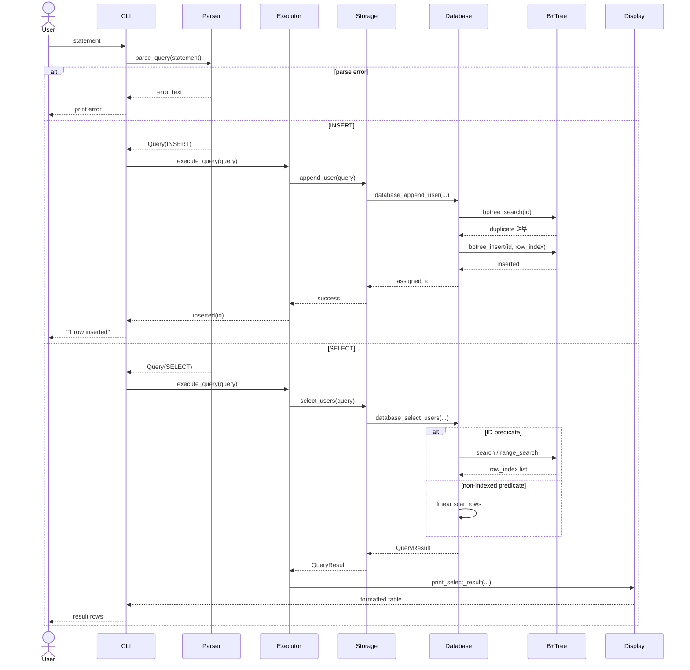

# Mini SQL Processor with B+ Tree Index

기존 C 기반 SQL 처리기에 `users.id`용 메모리 기반 B+ 트리 인덱스를 연결한 프로젝트입니다.  
핵심 목표는 `INSERT -> 자동 ID 부여 -> B+ 트리 인덱스 등록 -> ID 기반 SELECT 가속` 흐름을 구현하고, 대용량 데이터에서 인덱스 조회와 선형 탐색의 차이를 확인하는 것입니다.

**Purpose**
- 메모리 기반 B+ 트리 인덱스를 직접 구현하고 기존 SQL 처리기와 연결합니다.
- `WHERE id = ?`, `WHERE id BETWEEN ? AND ?` 경로에서 인덱스가 실제로 사용되도록 만듭니다.
- 1,000,000건 이상 삽입 후 `id` 조회와 비인덱스 필드 조회의 성능 차이를 검증합니다.

**Requirements**
- 구현 언어: C
- 자동 ID 부여 후 B+ 트리에 `id -> row_index` 등록
- 기존 SQL 처리기와 연동
- 단위 테스트와 기능 테스트 포함
- 벤치마크 실행 및 결과 비교 가능

**README Diagram**
Architecture Flow

```mermaid
flowchart TD
    subgraph Interface
        IN[/SQL statement or meta command/]
        OUT[/Prompt, result table, error text/]
    end

    subgraph Application
        CLI[CLI]
        META{Meta command?}
        PARSER[Parser]
        VALID{Parse success?}
        EXEC[Executor]
        DISP[Display]
    end

    subgraph Persistence
        STORE[Storage facade]
        DB[In-memory Database]
        IDXQ{ID-based predicate?}
        IDX[B+ Tree Index]
    end

    IN -->|"statement text"| CLI
    CLI --> META
    META -- Yes -->|"tables / schema / stats / benchmark request"| STORE
    STORE -->|"meta output"| OUT

    META -- No -->|"SQL text"| PARSER
    PARSER --> VALID
    VALID -- No -->|"parse error text"| OUT
    VALID -- Yes -->|"Query struct"| EXEC

    EXEC -->|"INSERT or SELECT request"| STORE
    STORE -->|"append / select request"| DB
    DB --> IDXQ
    IDXQ -- Yes -->|"id -> row_index lookup"| IDX
    IDX -->|"row_index or row_index list"| DB
    IDXQ -- No -->|"full row scan"| DB
    DB -->|"result rows"| DISP
    DISP -->|"formatted table"| OUT
```

Runtime Sequence



Persistent Resources
- `data/users.schema`: storage 초기화와 `.schema users` 출력에 사용되는 스키마 메타데이터
- `data/users.data`: 실제 row 영속화 파일
- 인덱스는 파일에 직접 저장하지 않고, 시작 시 `users.data`를 다시 읽어 메모리에서 재구성합니다

**Core Logic**
1. `INSERT INTO users VALUES ('alice', 23);`
- 파서가 `insert_has_id = 0`으로 해석합니다.
- `database_append_user()`가 `next_id`를 실제 `id`로 사용합니다.
- 새 row를 `rows[row_index]`에 저장합니다.
- 같은 `id`를 B+ 트리에 `key=id`, `value=row_index`로 삽입합니다.
- 이후 `next_id`를 1 증가시켜 다음 자동 ID를 준비합니다.

2. `SELECT * FROM users WHERE id = 10;`
- 파서가 `CONDITION_ID_EQ`로 변환합니다.
- 저장소가 인덱스 사용 가능한 `id` 조건임을 확인합니다.
- B+ 트리에서 `id -> row_index`를 찾습니다.
- 실제 출력 데이터는 `rows[row_index]`에서 읽습니다.

3. `SELECT * FROM users WHERE id BETWEEN 10 AND 20;`
- 파서가 `CONDITION_ID_RANGE`로 변환합니다.
- B+ 트리는 시작 key가 있는 리프까지 내려간 뒤, `next`로 연결된 리프를 따라가며 범위를 읽습니다.
- 이 경로가 B+ 트리의 범위 검색 장점을 가장 직접적으로 보여줍니다.

4. 비인덱스 조건
- `name`, `age` 조건은 현재 선형 탐색으로 처리합니다.
- 따라서 `WHERE name = 'alice'`는 전체 `rows[]`를 순회합니다.

**What Uses The Index**
- `WHERE id = ?`
- `WHERE id < ?`
- `WHERE id <= ?`
- `WHERE id > ?`
- `WHERE id >= ?`
- `WHERE id BETWEEN ? AND ?`

비인덱스 경로:
- `name`, `age` 조건
- `OR`가 포함된 복합 조건은 안전하게 전체 탐색으로 처리

**Build & Run**
```bash
make
./build/mini_sql
./build/mini_sql --stats
./build/mini_sql --benchmark 1000000 200
./build/mini_sql_tests
```

벤치마크 그래프 생성:
```bash
python3 scripts/benchmark_graph.py
```

**Demo Script**
```sql
INSERT INTO users VALUES ('alice', 23);
INSERT INTO users VALUES ('bob', 30);
SELECT * FROM users WHERE id = 1;
SELECT * FROM users WHERE id BETWEEN 1 AND 2;
SELECT * FROM users WHERE name = 'alice';
.stats
```

**Supported SQL**
- `INSERT INTO users VALUES ('alice', 23);`
- `INSERT INTO users VALUES (10, 'alice', 23);`
- `SELECT * FROM users;`
- `SELECT id, name FROM users WHERE id = 10;`
- `SELECT * FROM users WHERE name = 'alice';`
- `SELECT * FROM users WHERE id BETWEEN 10 AND 20;`
- `SELECT * FROM users WHERE id >= 250 AND age < 23;`
- `SELECT * FROM users WHERE id = 1 OR name = 'alice';`

Meta Commands
- `.help`
- `.tables`
- `.schema users`
- `.stats`
- `.benchmark [row_count] [lookup_count]`
- `.exit`

**Quality**
- 단위 테스트: [tests/tests.c](tests/tests.c)
- 파서 검증: INSERT, SELECT, 대소문자, 역방향 비교식, `AND/OR`, 실패 케이스
- 저장소 검증: 자동 ID 증가, 인덱스 조회, 선형 탐색, 대용량 인덱스 높이 증가
- 벤치마크 비교: `id` 조회(B+ 트리) vs `name` 조회(선형 탐색)

현재 확인 가능한 품질 포인트:
- 자동 ID 부여와 중복 ID 방지
- 잘못된 SQL에 대한 에러 메시지 반환
- 빈 결과를 정상 조회 결과로 처리
- 대용량 삽입 후 인덱스 기반 조회 동작 확인

**Benchmark**
- 실행 코드: [src/storage/benchmark.c](src/storage/benchmark.c)
- 결과 아티팩트: [docs/benchmark/benchmark_report.md](docs/benchmark/benchmark_report.md), [docs/benchmark/benchmark_results.csv](docs/benchmark/benchmark_results.csv), [docs/benchmark/benchmark_results.svg](docs/benchmark/benchmark_results.svg)
- 포함된 기준 데이터셋: `1,000`, `10,000`, `100,000`, `500,000`, `1,000,000`
- 커밋된 기준 결과에서 최대 데이터셋은 `1,000,000` rows, `200` lookups 입니다

**Project Layout**
```text
.
|-- data/         # users.schema, users.data
|-- docs/         # 설계 문서와 benchmark 결과
|-- examples/     # 예제 SQL
|-- include/      # 공개 헤더
|-- scripts/      # benchmark 그래프 생성 스크립트
|-- src/
|   |-- app/      # main, CLI
|   |-- core/     # parser, executor, display
|   |-- index/    # B+ tree
|   `-- storage/  # file I/O, in-memory DB, benchmark
`-- tests/        # unit / functional tests
```

**Scope & Constraints**
- 현재는 `users` 단일 테이블만 지원합니다.
- B+ 트리는 메모리 기반이며, 영속화되는 것은 row 데이터입니다.
- 프로그램 시작 시 `data/users.data`를 다시 읽어 인덱스를 재구성합니다.
- schema는 메타데이터와 출력 정렬에 사용되며, 내부 row 구조는 `UserRow`로 고정돼 있습니다.

**References**
- B+ 트리 설명: [docs/bptree.md](docs/bptree.md)
